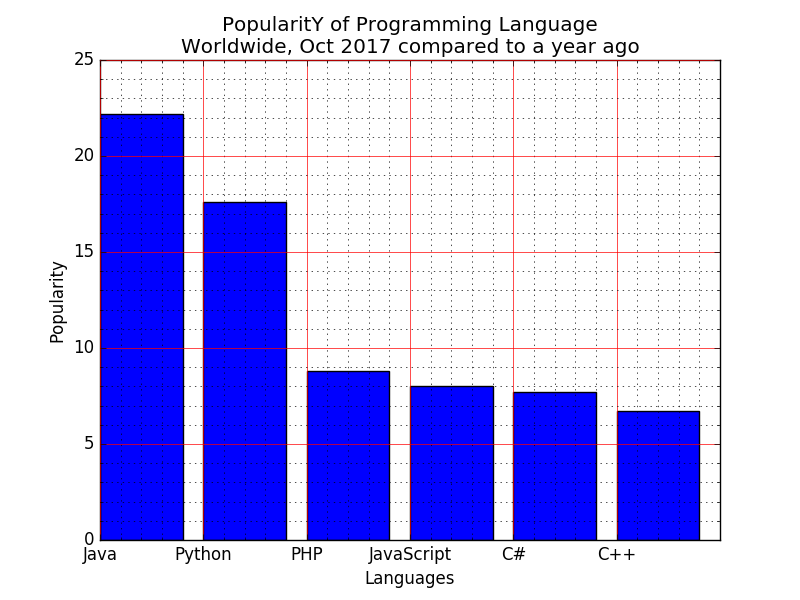

# I. Bar chart
&nbsp;## 1. 1. Write a Python programming to display a bar chart of the popularity of programming Languages. Go to the editor 
&nbsp;## Sample data:
&nbsp;## Programming languages: Java, Python, PHP, JavaScript, C#, C++
&nbsp;## Popularity: 22.2, 17.6, 8.8, 8, 7.7, 6.7
&nbsp;## The code snippet gives the output shown in the following screenshot:
&nbsp;
