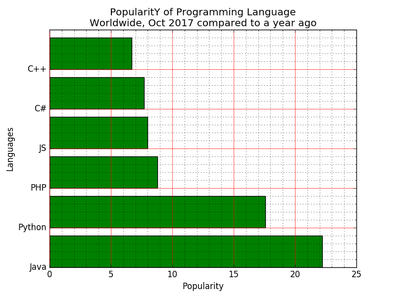
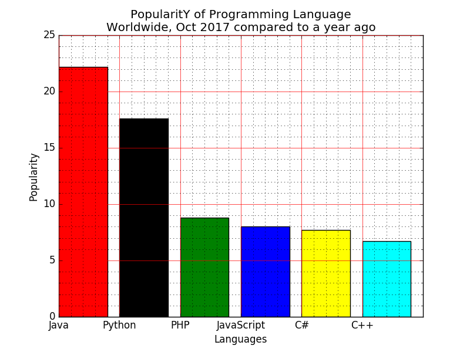
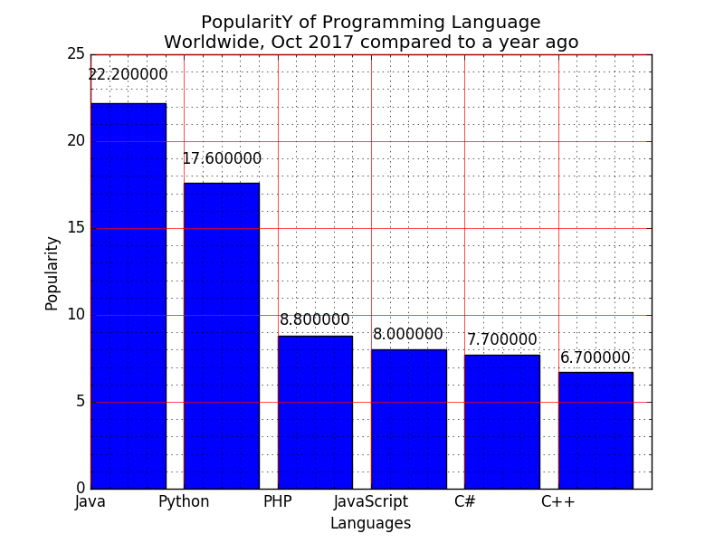
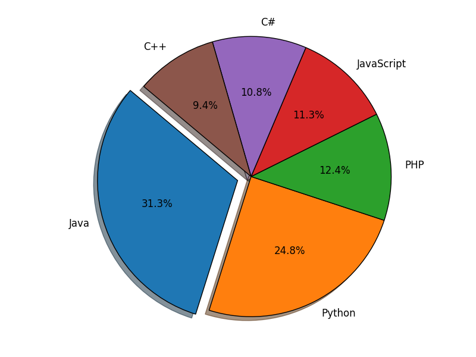
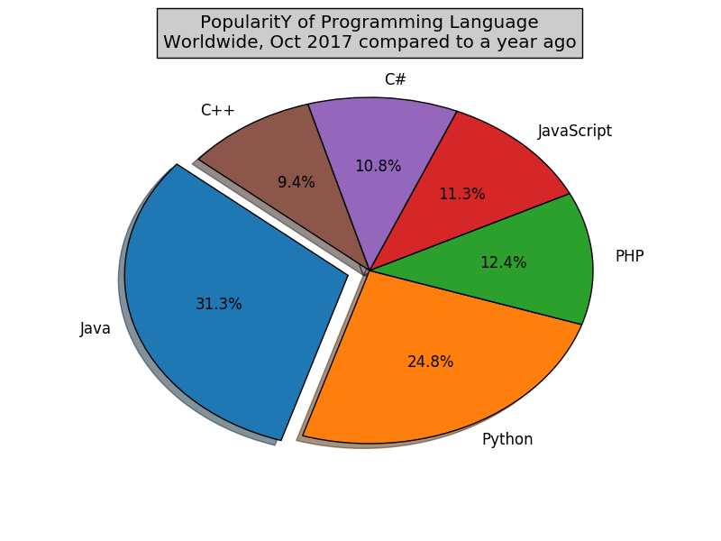
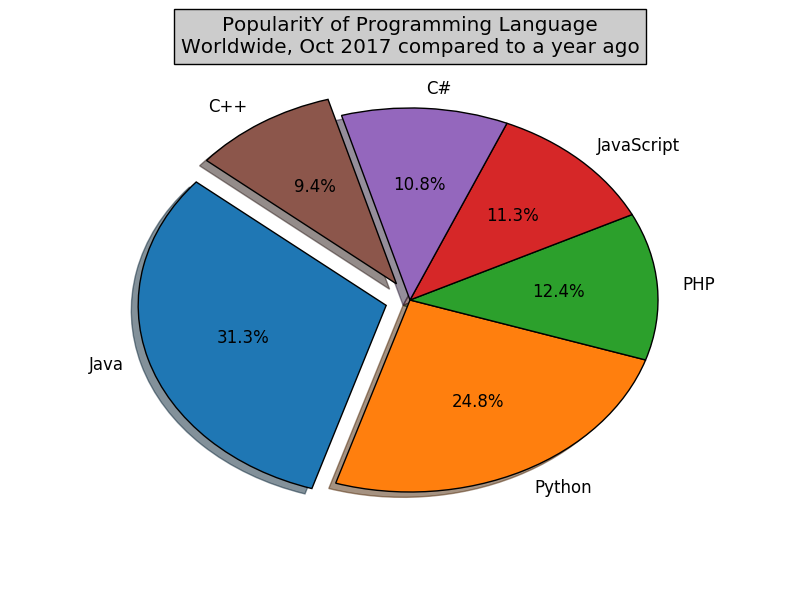
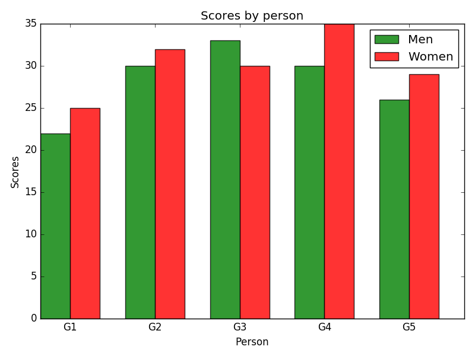

# I. Bar chart
## &nbsp; 1.
## &nbsp; Sample data:
## &nbsp; Programming languages: Java, Python, PHP, JavaScript, C#, C++
## &nbsp; Popularity: 22.2, 17.6, 8.8, 8, 7.7, 6.7
## &nbsp; The code snippet gives the output shown in the following screenshot

## &nbsp; - Write a Python programming to display a bar chart of the popularity of programming Languages.
## &nbsp; - Display a horizontal bar chart

## &nbsp; - Use different color for each bar

## &nbsp; - Attach a text label above each bar displaying its popularity (float value)

## &nbsp; - Create a pie chart

## &nbsp; - Set a title

## &nbsp; - Make multiple wedges of the pie

## &nbsp; 2.
## &nbsp; Sample Data:
## &nbsp; Means (men) = (22, 30, 35, 35, 26)
## &nbsp; Means (women) = (25, 32, 30, 35, 29)
## &nbsp; The code snippet gives the output shown in the following screenshot
## &nbsp; - Write a Python program to create bar plot of scores by group and gender. Use multiple X values on the same chart for men and women.

